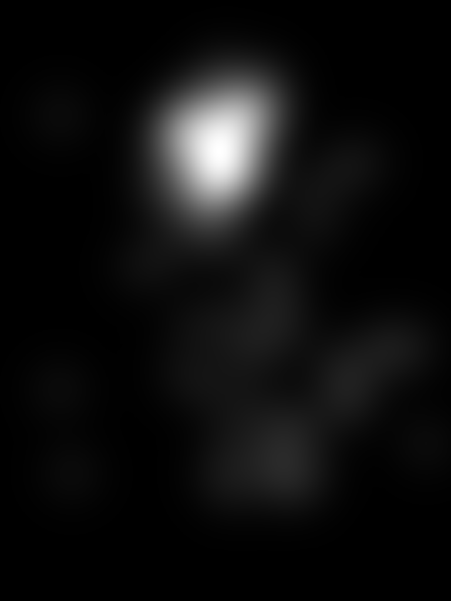
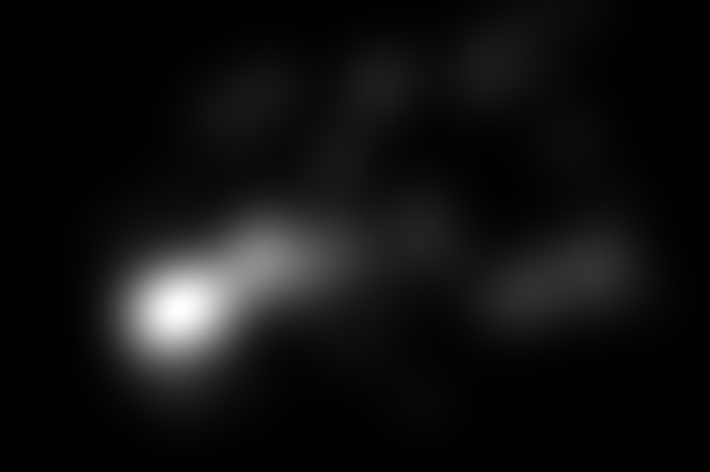
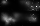
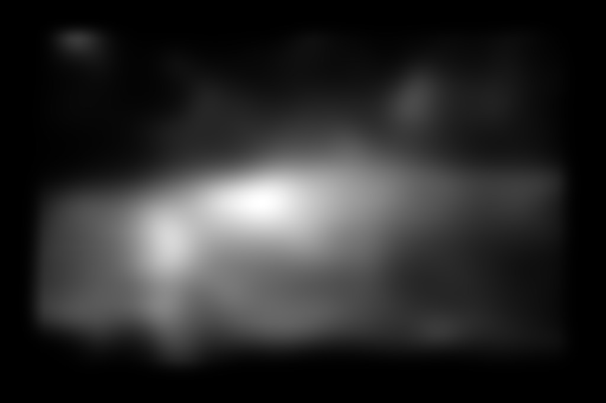

# Benchmarking Saliency Models for TD and ASD Fixation Prediction

**Project Overview** This project benchmarks the performance of three computational saliency models, such as **CovSal**, **GBVS**, and **FES**, in predicting human visual attention. Specifically, it evaluates how well these models approximate fixation patterns in two distinct populations: **Typically Developing (TD)** children and children with **Autism Spectrum Disorder (ASD)**.

By comparing predicted saliency maps against ground-truth fixation maps, we analyze the models' effectiveness using metrics like AUC, Correlation Coefficient (CC), and Normalized Scanpath Saliency (NSS).

---

## **🖼️ Visual Examples**

Below are examples of the Ground Truth Fixation Maps for TD and ASD groups, alongside Saliency Maps generated by the models.

| TD Fixation Map | ASD Fixation Map |
| :---: | :---: |
|  |  |
| **GBVS Saliency Map** | **FES Saliency Map** |
|  |  |

---

## **📊 Evaluation Results**

We evaluated the models on the **Jute Pest Dataset** using 8 distinct metrics.

### **1. Typically Developing (TD) Group**
**Analysis:** FES emerged as the best-performing model for the TD group, achieving the highest scores in **AUC_Judd (0.7547)**, **CC (0.4792)**, and **NSS (0.3204)**. CovSal followed in second place, while GBVS showed the lowest alignment with actual fixation points.

| Model | AUC_Borji | AUC_Judd | AUC_shuffled | CC | EMD | Info Gain | KLdiv | NSS |
| :--- | :--- | :--- | :--- | :--- | :--- | :--- | :--- | :--- |
| **CovSal** | 0.5467 | 0.7395 | 0.5466 | 0.3519 | 27.8452 | -2.4029 | 2.4248 | 0.2349 |
| **GBVS** | 0.5309 | 0.6915 | 0.5309 | 0.2374 | 21.7782 | -1.0883 | 1.6492 | 0.1599 |
| **FES** | **0.5872** | **0.7547** | **0.5871** | **0.4792** | **18.8345** | **-2.1473** | **2.1083** | **0.3204** |

---

### **2. Autism Spectrum Disorder (ASD) Group**
**Analysis:** Similar to the TD results, **FES** outperformed the other models for the ASD group, with an **AUC_Judd of 0.7098**. GBVS struggled significantly in this category, with a Correlation Coefficient (CC) of only 0.2083, indicating it does not align well with the unique fixation patterns of individuals with ASD.

| Model | AUC_Borji | AUC_Judd | AUC_shuffled | CC | EMD | Info Gain | KLdiv | NSS |
| :--- | :--- | :--- | :--- | :--- | :--- | :--- | :--- | :--- |
| **CovSal** | 0.5364 | 0.6768 | 0.5364 | 0.3112 | 28.8875 | -2.6417 | 2.6399 | 0.1833 |
| **GBVS** | 0.5239 | 0.6703 | 0.5238 | 0.2083 | 21.4376 | -1.2097 | 1.6716 | 0.1231 |
| **FES** | **0.5684** | **0.7098** | **0.5683** | **0.4300** | **18.6133** | **-2.4205** | **2.3462** | **0.2512** |

---

## **🚀 Implemented Models & How to Run**

### **1. CovSal**
**Paper:** [CovSal Project](https://web.cs.hacettepe.edu.tr/~erkut/projects/CovSal/)

* **Running from this Repository:**
    1.  Open the `CovSal` folder inside the repository.
    2.  Navigate to the `saliency` folder.
    3.  Run `generate_saliency_maps.m` in MATLAB.
    4.  *Note:* Modify the folder directory in the script to match your local dataset location.

* **Evaluation:** Run `perform_evaluation.m` in MATLAB.

### **2. GBVS (Graph-Based Visual Saliency)**
**Paper:** [GBVS Project](https://pkuml.org/resources/code.html)

* **Running from this Repository:**
    1.  Open the `CovSal` folder inside the repository.
    2.  Navigate to the `corSal` folder.
    3.  Run `generate_saliency_map.m` in MATLAB.
    4.  *Note:* Modify the folder directory in the script to match your local dataset location.

* **Evaluation:** Open the `corSal` folder and run `perform_evaluation.m`.

### **3. FES (Fast and Efficient Saliency)**
**Paper:** [FES Paper](https://link.springer.com/content/pdf/10.1007/978-3-642-21227-7_62)

* **Running from this Repository:**
    1.  Open the `FES-master` folder inside the repository.
    2.  Run `generate_saliency_map.m` in MATLAB.
    3.  *Note:* Modify the folder directory in the script to match your local dataset location.

* **Evaluation:** Open the `FES-master` folder and run `perform_evaluation.m`.

---

## **⚙️ Evaluation Configuration**

The evaluation scripts (`perform_evaluation.m`) compute the following metrics:
* **AUC variants**: AUC_Borji, AUC_Judd, AUC_shuffled
* **Correlation**: CC (Correlation Coefficient)
* **Distribution**: EMD (Earth Mover’s Distance), KLdiv (Kullback-Leibler Divergence)
* **Other**: Info Gain, NSS (Normalized Scanpath Saliency)

**Setup Instructions:**
Ensure the paths in the script are set correctly:
* `td_fixation_folder` → Path to TD fixation files.
* `asd_fixation_folder` → Path to ASD fixation files.
* `prediction_folder` → Path to the saliency maps generated by the model.

---

## **🔗 Dataset**

**Download Link**: [Dropbox Link](https://www.dropbox.com/scl/fi/bwc7kmzyfqso7ggrvtj98/Saliency4asd.zip?rlkey=disd4gvwrel3msj779r4md1ln&st=keufkyw8&dl=0)

**Reference**:
Duan H, Zhai G, Min X, Che Z, Fang Y, Yang X, Gutiérrez J, Callet PL. *A dataset of eye movements for the children with autism spectrum disorder.* In Proceedings of the 10th ACM Multimedia Systems Conference 2019 Jun 18 (pp. 255-260).

---

## **Acknowledgments**
* CovSal, GBVS, and FES implementations are sourced from their respective original research papers.
* We acknowledge the original authors for their contributions to saliency map research.
